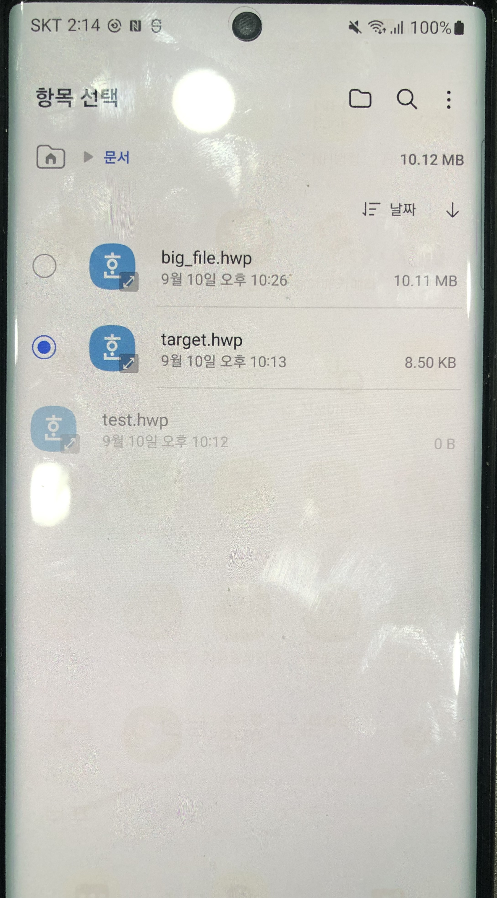
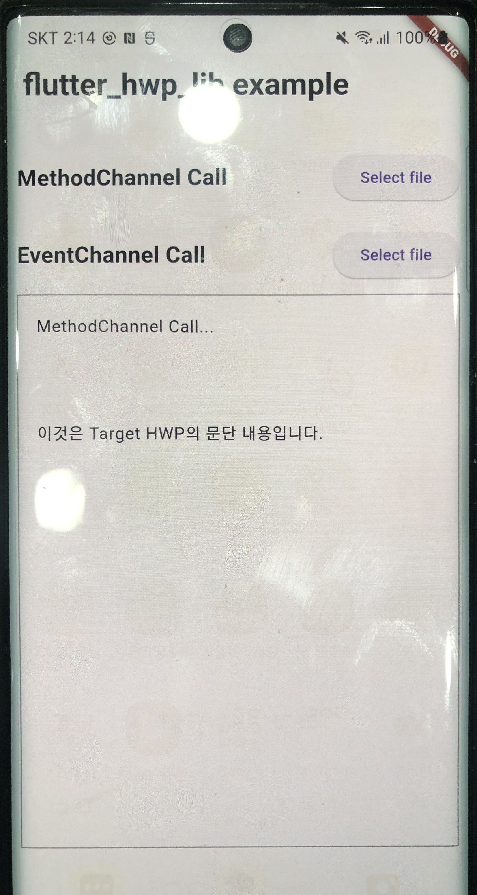
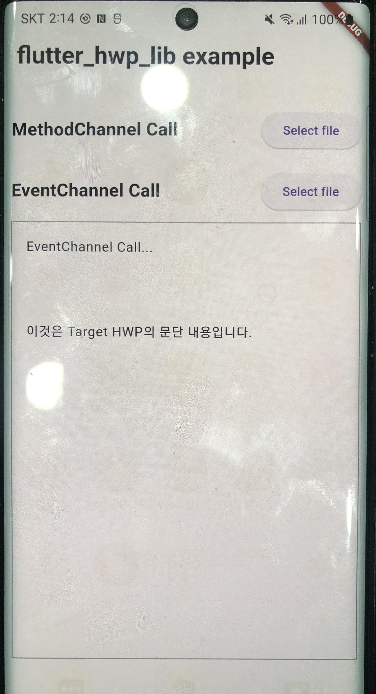

# flutter_hwp_lib

"flutter_hwp_lib plugin project"

## 1. Introduction

* This project was initiated to extract text from HWP files created in the Hangul program by Hancom 
  
  and has been developed to make it usable in Flutter by utilizing the Java library called hwplib(https://github.com/neolord0/hwplib).


* I would like to inform you that an API for extracting text has been written based on the examples provided by hwplib.

 
* When utilizing the example, we used the file_picker library for dependency.


## 2. Screenshots


| Home                                            | Select File                                           | MethodChannel Call                                     | EventChannel Call                                     |
|-------------------------------------------------|-------------------------------------------------------|--------------------------------------------------------|-------------------------------------------------------|
|  |  |  |  |


| Home                           | Select File                                 | MethodChannel Call                | EventChannel Call             |
|--------------------------------|---------------------------------------------|-----------------------------------|--------------------------------|
|  |  |  |  |


## 3. Usage
```dart
import 'package:flutter_hwp_lib/flutter_hwp_lib.dart';

//plugin instance 
final _flutterHwpLibPlugin = FlutterHwpLib();

//extractingText
var filePath = 'file path';
var text = await _flutterHwpLibPlugin.extractingText(filePath);

//extractingTextFromBigFile
var filePath = 'file path';
await _flutterHwpLibPlugin.extractingTextFromBigFile(filePath).listen((event) {
//event handler
});
```

## Reference
1. hwplib library: https://github.com/neolord0/hwplib
2. file_picker plugin: https://pub.dev/packages/file_picker
3. The document titled 'Hangeul Document File Structure 5.0' 
   : http://www.hancom.com/etc/hwpDownload.do?gnb0=269&gnb1=271&gnb0=101&gnb1=140.
